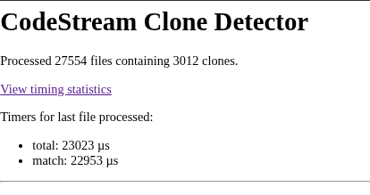
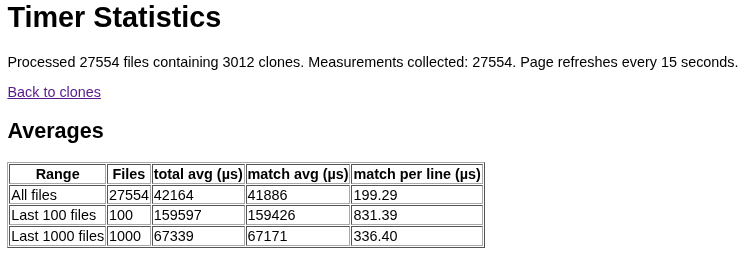
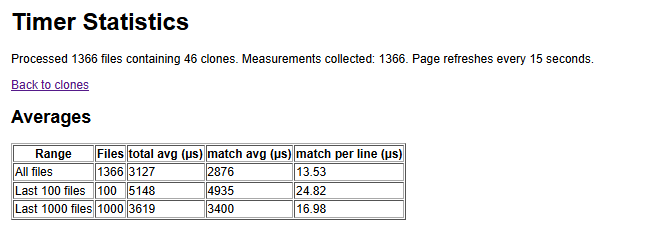
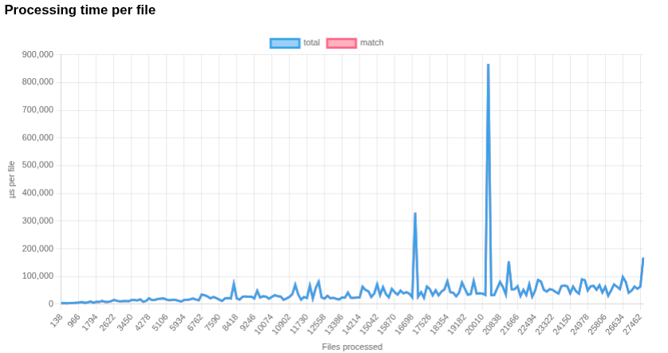
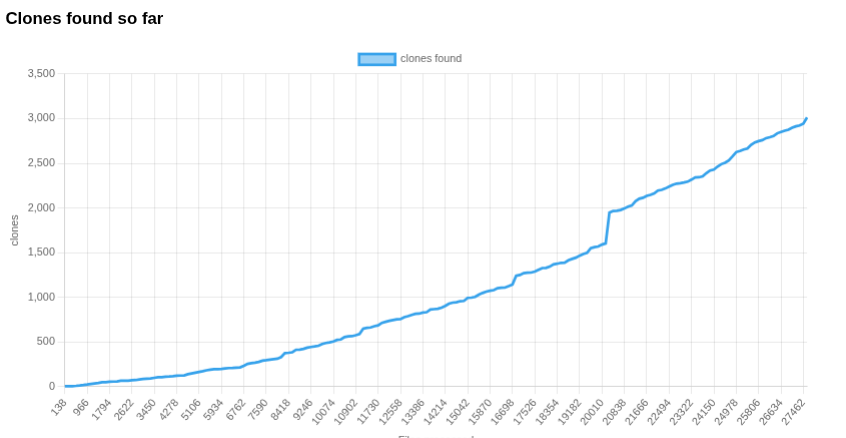
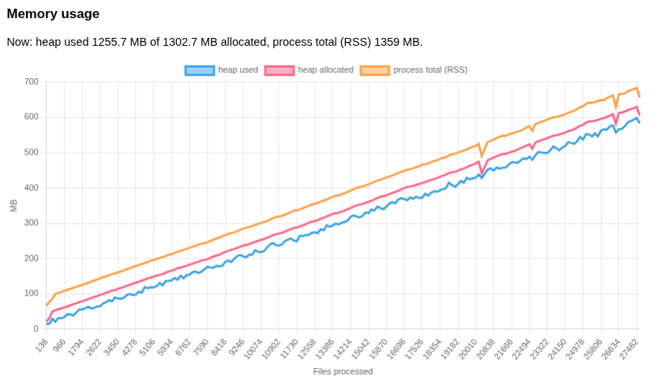
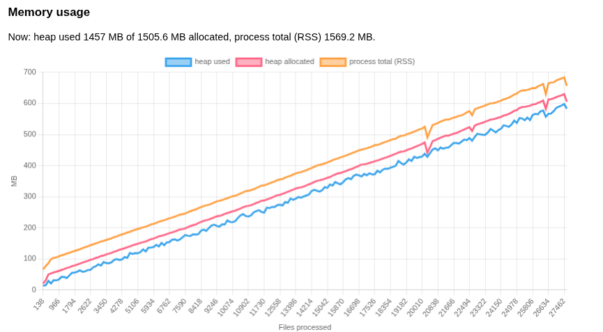
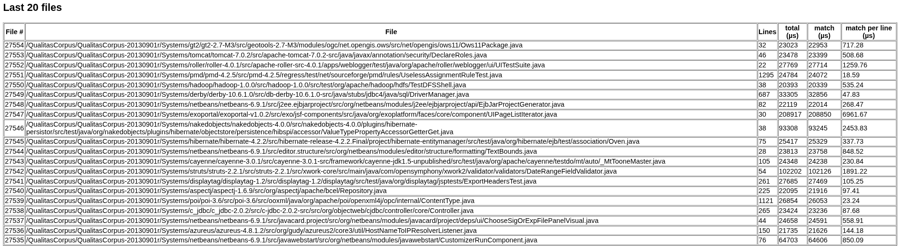

# CodeStreamConsumer – Code Stream Clone Detector

**Course:** Applied Cloud Computing and Big Data

**Assignment:** Working with a Stream of Data

**Team:** Dawood Rahimi and Ali Reza Sharifi

**Date:** 2026-10-05

This README is our report. It describes:

- how we implemented the two `TODO` tasks and how we tested them
- the results of running the consumer on the Qualitas Corpus, and our analysis of those results
- our answers to the assignment questions (section 6)

**Scope.** As the assignment says, we only implemented the `TODO` parts:

1. the three missing methods in `CloneDetector.js`
2. the timing statistics page in `index.js`

We deliberately left the rest of the given code unchanged. Weaknesses we found in it are discussed in the
analysis below instead of being fixed.

---

## 1. Running it

```bash
# from BigDataAnalytics/
cd Containers && make codeStreamGenerator codeStreamConsumer && cd ..
make corpusGet          # once: unpacks the Qualitas Corpus tar files from Data/ into the qc-volume
make codeStream         # starts generator + consumer (docker compose -f stream-of-code.yaml up)
```

| URL | Content |
|---|---|
| `http://localhost:8080/` | Clones found so far, timers for the last file, processed files |
| `http://localhost:8080/timers` | Our timing statistics page (averages, charts, memory, last 20 files) |

Unit tests for the clone detector: `node test-filter.js` (12 checks, all pass).

---

## 2. TODO 1 – Completing the CloneDetector

`matchDetect()` compares a new file against every previously stored file `f`. For each `f` it runs three steps.

### 2.1 `#filterCloneCandidates(file, compareFile)` – find matching chunks

```js
file.instances = file.instances || [];
let newInstances = file.chunks
    .map(sourceChunk =>
        compareFile.chunks
            .filter(targetChunk => this.#chunkMatch(sourceChunk, targetChunk))
            .map(targetChunk => new Clone(file.name, compareFile.name, sourceChunk, targetChunk)))
    .flat();
file.instances = file.instances.concat(newInstances);
```

**How:**
- For every chunk in the new file, `filter` finds all equal chunks in the stored file, and `map` turns each match
  into a `Clone`.
- This gives an array of arrays, which `flat()` turns into a single list.

**Why:**
- This follows the hints in the TODO (filter → map → flat).
- We use `concat` instead of overwriting, because `matchDetect()` calls this method once per stored file, and
  clones found against earlier files must be kept (TIP 3).
- A chunk is `CHUNKSIZE` (5) consecutive non-empty, comment-free lines. Two chunks match when all their lines have
  the same text. Line numbers are ignored, so code at different places in the files still matches.

### 2.2 `#expandCloneCandidates(file)` – merge overlapping clones

```js
file.instances = file.instances.reduce((expandedClones, clone) => {
    let wasExpanded = false;
    for (let existingClone of expandedClones) {
        if (existingClone.maybeExpandWith(clone)) { wasExpanded = true; break; }
    }
    if (!wasExpanded) expandedClones.push(clone);
    return expandedClones;
}, []);
```

**How:**
- Chunks are a sliding window, so a clone that is 7 lines long is first found as three 5-line clones: lines 1–5,
  2–6 and 3–7.
- The `reduce` walks through the clones in order. If a clone continues one already in the accumulator,
  `Clone.maybeExpandWith()` grows that clone. Otherwise the clone is added as a new one.

**Why:**
- The TODO asks for clones that are "expanded as much as they can" and without the small clones used to build them.
- The clones arrive in file order, so only forward expansion is needed, as the TODO says (ASSUME).

### 2.3 `#consolidateClones(file)` – one clone, several targets

```js
file.instances = file.instances.reduce((uniqueClones, clone) => {
    let existingClone = uniqueClones.find(c => c.equals(clone));
    if (existingClone) existingClone.addTarget(clone);
    else uniqueClones.push(clone);
    return uniqueClones;
}, []);
```

**How:** if the same source lines (same file, start and end) were found in several places, the clones are merged
into one `Clone` with several `targets`.

**Why:**
- The result is a *clone class* ("this code also appears in A, B and C") instead of many duplicate clone pairs.
- This follows the TODO's tips: `reduce` with an empty accumulator, and `find` together with `Clone.equals()`.

### 2.4 Testing

`test-filter.js` runs the detector on small hand-made files.

| Part | Method tested | What the checks verify |
|---|---|---|
| A | `#filterCloneCandidates` | One clone per matching chunk; no false matches; existing clones are kept |
| B | `#expandCloneCandidates` | Chunks 1–5, 2–6, 3–7 become one clone 1–7; separate clones stay separate |
| C | `#consolidateClones` | The same lines found in two files, or twice in one file, become one clone with two targets |

We also ran the system with the teacher's `A.java` and `B.java`, which the generator sends first when started
with `TEST`, and checked that the clones between them show up on the main page.

---

## 3. TODO 2 – Timing statistics page (`/timers`)

The original page only showed the timers for the *last* file, which says nothing about trends. The TODO asks for
timers from every file, a new landing page, averages over all files, the last 100 and the last 1000, and
perhaps a graph.

### What we store per file (`storeTimerHistory`)

| Field | Why |
|---|---|
| `fileNumber`, `fileName` | x-axis of the trends, and to identify slow files |
| `timers` (`total`, `match`) | The raw measurements |
| `lines` | To normalise the time by file size. Counted from `file.contents`, because `pruneFile()` has already deleted `file.lines` at this point. |
| `clones` | Total clones found so far, to see how the clone store grows |
| `memory` | `process.memoryUsage()` (heap used, heap allocated, RSS), to see how memory grows |

### What the page shows

1. **Averages table** for all files, the last 1000 and the last 100. It includes **match time per line**,
   computed as sum(match) / sum(lines), so that a big file is not mistaken for a slower algorithm and tiny files
   do not dominate the average.
2. **Charts** (Chart.js):
   - processing time per file
   - match time per line
   - clones found so far
   - memory usage
3. **The last 20 files**, with lines, times and time per line.
4. **Auto-refresh** every 15 seconds, so a long run can be followed live.

### Design choice: keep the statistics page cheap

**The problem:** a page that lists every file (or plots one point per file) grows with the run, and generating
it would itself slow down the consumer we are measuring.

**What we did:**
- Each chart has **at most 200 points**. Each point is the average of a group of files processed one after
  another.
- The table only shows **the last 20 files**.

---

## 4. Results

### 4.1 The runs

All times are local time (CEST).

| Run | Result |
|---|---|
| First run | Crashed at about **22,500 files** (11:50) with `TypeError: Cannot read properties of undefined (reading 'filepath')` at `index.js:20` |
| Short run (screenshot 8) | **1,366 files**, 46 clones |
| Main run | Started 12:07. Processed **27,554 files** and found **3,012 clones** by about **12:45**. After that **no more files were processed**. Stopped manually at about **14:00** |

The corpus has **163,596 Java files**, so we processed about **17 %** of it.

### 4.2 Screenshots (main run)

| | |
|---|---|
| Main page |  |
| Averages at 27,554 files |  |
| Averages at 1,366 files (short run) |  |











---

## 5. Analysis

### 5.1 Processing time grows with the number of files already processed

**Comparison of the two runs:**

| | 1,366 files | 27,554 files | Ratio |
|---|---|---|---|
| Files processed | 1,366 | 27,554 | **20×** |
| Avg total time, all files | 3.1 ms | 42.2 ms | 13× |
| Avg match time, last 1000 files | 3.4 ms | 67.2 ms | **20×** |
| Match per line, last 1000 files | 17.0 µs | 336.4 µs | **20×** |
| Avg match time, last 100 files | 4.9 ms | 159.4 ms | 32× |
| Clones found | 46 | 3,012 | **65×** |

**What the numbers show:**
- With 20 times as many files stored, processing the next file takes about **20 times longer**, measured over
  the last 1000 files.
- So the cost of one file grows **linearly** with the number of stored files, O(n) per file. Summed over the
  whole stream that is **O(n²)**.
- The reason is that `matchDetect()` compares the new file with **every** stored file, and every chunk with
  every chunk.
- The "last 100" ratio (32×) is higher than 20×, because it is pulled up by a few very slow files just before
  the stall (208 ms, 102 ms and 93 ms in the last-20 table).
- The average over all files grows less (13×), because it also contains all the fast early files.

**The time-per-file chart:**
- It rises from about 5 ms per file at the start, to about 20–30 ms at 10,000 files, to about 50–80 ms at
  25,000 files.
- The `match` line is hidden behind `total`, because match detection is about **99 %** of the total time
  (41.9 ms of 42.2 ms on average). Pre-processing and transformation hardly matter.
- There are two big spikes, about 330 ms at ~17,000 files and about 860 ms at ~20,400 files. They line up
  exactly with the two jumps in the *clones found* chart (about +90 and +350 clones). These are files that
  share code with many earlier files. They create many clones, and expanding and consolidating them costs
  O(k²), because `#expandCloneCandidates` and `#consolidateClones` search the accumulator for every clone.
- Smaller, irregular spikes are most likely garbage-collection pauses, which get longer as the heap grows past
  1 GB.

**A floor for small files (last-20 table):**
- A 32-line file and a 1,295-line file both take about 23 ms.
- That is the fixed cost of looping over about 27,500 stored files. For every stored file the detector calls
  filter, expand and consolidate, even when nothing matches.
- This is why small files get a high "per line" value: 717 µs/line for 32 lines, against 18.6 µs/line for 1,295
  lines.
- The cost per file therefore depends far more on how many files are stored than on the size of the file.

### 5.2 Clones grow faster than files

- The number of files grew 20×, but the number of clones grew 65×.
- The more files are stored, the more likely it is that a new file shares code with one of them.
- Most of the corpus' systems also contain several versions of the same libraries, which produces many real
  clones.

### 5.3 Memory grows linearly and is never released

- In the memory chart, heap used grows in an almost straight line, to about **590 MB at 27,500 files**. That is
  roughly **21 KB per file**.
- `FileStorage` keeps every processed file, with its contents and all its chunks of `SourceLine` objects, and
  `CloneStorage` keeps every clone. Nothing is ever freed.
- The small dip at ~20,400 files is a garbage collection that only frees temporary objects. The line
  immediately keeps climbing.
- At this rate the whole corpus would need about **3.5 GB** of heap (rough extrapolation), which is around
  Node's default heap limit. Even without the problem in 5.4 the consumer would probably slow down and then
  crash with "JavaScript heap out of memory" long before the end.

### 5.4 Why the consumer hung at 27,554 files

After 12:45 the page stayed at 27,554 files, but the consumer:

- still answered HTTP requests within milliseconds
- used **100 % CPU**
- kept growing in memory: heap used went from **1,256 MB** (screenshot 5) to **1,457 MB** (screenshot 6), while
  the charts did not get a single new point
- had **284,469 uploaded temp files (835 MB)** in `/tmp` that were never processed

**The cause is in the given upload code (`fileReceiver` in `index.js`), not in the clone detector.** One
`formidable` form object is created once and shared by all requests. In formidable 2.1.5:

1. **Listeners pile up.** Every `form.parse()` adds four new event listeners (`field`, `file`, `error`, `end`)
   to the shared object and never removes them. This is what the `MaxListenersExceededWarning` in the log
   warns about. After hundreds of thousands of uploads, every upload has to run through all the old listeners.
   That explains the 100 % CPU and the growing memory.
2. **Concurrent uploads disturb each other.** The `end` event of one upload can call the callback of another
   upload whose file has not arrived yet, so `files.data` is `undefined`. This is the `TypeError` that crashed
   the first run at ~22,500 files.
3. **One error stops everything.** Once any upload fails, the shared form keeps its error flag. Formidable then
   never emits `end` again (`if (this.error) return;`), so `processFile()` is never called again. The files are
   still written to `/tmp`, which is why they pile up there.

---

## 6. Answers to the assignment questions

### Q1. Are you able to process the entire Qualitas Corpus? If not, why does the CodeStreamConsumer hang, and how can it be avoided?

**No.** The consumer stopped making progress after 27,554 files, about 17 % of the corpus. After that it still
answered HTTP requests, but it used 100 % CPU, its memory kept growing (heap 1,256 → 1,457 MB without any new
file being processed), and **284,469 uploaded files (835 MB)** piled up unprocessed in `/tmp`.

The main issues, in terms of data processing and storage, are:

1. **Everything is stored in memory.** `FileStorage` keeps every file with all its chunks, and `CloneStorage`
   keeps every clone. Nothing is released, so memory grows by about 21 KB per file. The whole corpus would need
   about 3.5 GB of heap, which is around Node's default limit.
2. **Each file is compared with all earlier files.** The work per file grows with the number of stored files, so
   the consumer gets slower and slower and falls further behind the incoming stream.
3. **Shared upload state.** One `formidable` form object is reused for every request:
   - Each request adds listeners to it that are never removed (`MaxListenersExceededWarning`), which costs CPU and
     memory.
   - Concurrent uploads disturb each other, which caused the crash in the first run.
   - After a single failed upload, the form never signals "end" again, so `processFile()` is never called. This is
     the hang in the main run (section 5.4).
4. **No cleanup and no backpressure.** Temp files are never deleted. The generator sends files regardless of
   whether the consumer has processed them, so unprocessed data piles up.

**How to avoid them:**
- Store files, chunk hashes and clones in a **database** (MongoDB is already a dependency) instead of in memory.
- Use a **hash index** of chunks (see Q2), so that a new file is not compared with every earlier file.
- Create a **new `formidable()` object per request**, handle errors, and **delete each temp file** after reading
  it.
- Add a **queue / backpressure**: only accept or acknowledge a new file when the previous one has been processed.

### Q2. Comparing two chunks implies CHUNKSIZE comparisons of SourceLines. What can be done to reduce the number of comparisons?

1. **Stop at the first mismatch.** Our `#chunkMatch` compares all lines even after a difference is found. Most
   chunk pairs differ on the first line, so stopping there saves most of the work.
2. **Hash each chunk** once, when it is created (for example MD5 of its normalised lines). Comparing two chunks is
   then **one** comparison instead of `CHUNKSIZE`, and a short hash takes less memory than five `SourceLine`
   objects.
3. **Index the hashes** in a map (hash → list of file and line). Instead of comparing a new chunk with every chunk
   of every stored file, we do a single lookup. This removes almost all comparisons, and turns the O(n) cost per
   file into roughly constant time.

### Q3. Do you see any trends in the time to process each file as the number of processed files grows? Why?

**Yes. The time per file grows linearly with the number of files already processed.** With 20× as many files
stored (1,366 → 27,554), the match time per file over the last 1000 files was also 20× longer (3.4 → 67.2 ms;
section 5.1). The time-per-file chart rises steadily from about 5 ms to about 50–80 ms per file. If each file
costs O(n), the whole stream costs **O(n²)**.

Reasons in the algorithm:

- **`matchDetect()` loops over every stored file**, and `#filterCloneCandidates` compares every chunk of the new
  file with every chunk of the stored file. More stored files means proportionally more comparisons.
- **There is a fixed cost per stored file**, because filter, expand and consolidate run for every stored file
  even when nothing matches. This gives even a 30-line file a floor of about 23 ms at 27,000 stored files, and it
  is why small files show a very high time per line.
- **Expanding and consolidating cost O(k²) in the number of clones (k)**, because the accumulator is searched for
  every clone. Files that share code with many earlier files produce many clones and take much longer. The two
  biggest spikes (≈ 330 ms and ≈ 860 ms) occur exactly where the "clones found" chart jumps.
- **The heap grows constantly**, so garbage-collection pauses become longer and more frequent. This gives
  irregular spikes later in the run.
- **Clones grow faster than files** (65× against 20×). The more files are stored, the more likely a new file
  matches one of them, which adds to the expand and consolidate cost.

**What this implies:** the cost per file depends on how many files are stored, not on the file's own size. The
design does not scale to a stream, because it needs an index instead of comparing each file with all earlier
ones.

### Q4. Code

The zip contains the whole `Containers/CodeStreamConsumer` folder (without `node_modules`). Our changes are in:

- `src/CloneDetector.js`: `#filterCloneCandidates`, `#expandCloneCandidates`, `#consolidateClones` (section 2)
- `src/index.js`: timer history and the `/timers` page (section 3)
- `test-filter.js`: our tests (`node test-filter.js`)
- `README.md` (this report) and `screenshots/`

---

## 7. Accuracy and known limitations

- **Clones are exact text matches** of normalised lines (comments, empty lines and leading/trailing whitespace
  removed). Renamed variables or reformatted code (type-2/type-3 clones) are not found. Very common boilerplate
  (getters, closing braces) can create uninteresting clones.
- **Expansion only checks source lines.** The given `Clone.isNext()` does not check that the target continues
  too. If lines 1–5 of a new file N match file X and lines 2–6 match a different file Y, the result is one clone
  "N lines 1–6 found in X". That is too long for X, and the match with Y is lost. We verified this with a small
  test and left it unchanged, because it is outside the TODOs.
- **`CHUNKSIZE` from the environment is a string**, so `i + chunkSize` in `#chunkify` concatenates text instead
  of adding numbers, and the detector crashes. This does not happen with the default compose file, where
  `CHUNKSIZE` is not set.
- **`isFileProcessed()` always returns `false`** (a known FIXME in the given code), so the same file can be
  processed twice.

## 8. Possible future improvements

1. Hash chunks and use a hash index (Q2): the biggest gain in both time and memory.
2. Move file and clone storage to a database, and keep the consumer's memory almost constant.
3. Fix the upload handling: one `formidable` per request, delete temp files, and add a queue for backpressure.
4. Make `Clone.isNext()` also check that the target lines continue, so clones are merged correctly.
5. Use several consumers (workers) that share the hash index, so the stream can be processed in parallel.
